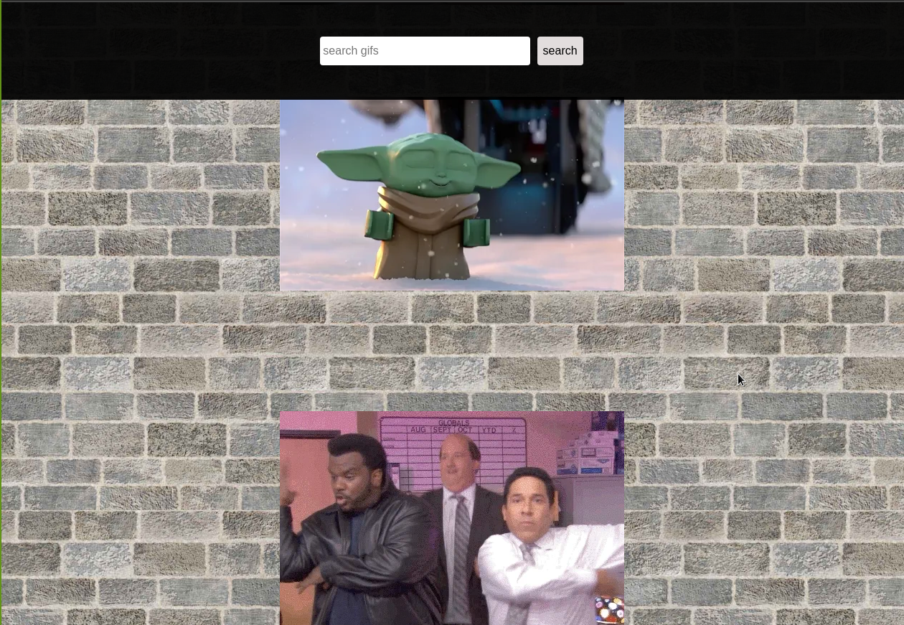

#Giphy


> In this project the user can search for giphs.It displays 10 giphs initially and it loads more when the user is at the bottom of the page



## Build With

- HTML
- CSS
- Typescript
- React
- Bootstrap

## Installation
```
  $ git git@github.com:SimonGrchevski/Giphy.git

  $ cd Giphy

  $ npm i

  $ npm start

```

### Deploy using
- Heroku

## Demo
[live link](https://damp-beach-57726.herokuapp.com/)

## Author

👤 Simon Grchevski

- GitHub: [Github](https://github.com/SimonGrchevski)
- LinkedIn: [LinkedIn](https://www.linkedin.com/in/simon-grchevski-682935209/)
- Twitter: [Twitter](https://twitter.com/grchevski)

## 🤝 Contributing

Contributions, issues, and feature requests are welcome!

Feel free to check the [issues page](../../issues/).

## Show your support

Give a ⭐️ if you like this project!

## Acknowledgments

- Hat tip to anyone whose code was used
- Inspiration
- etc